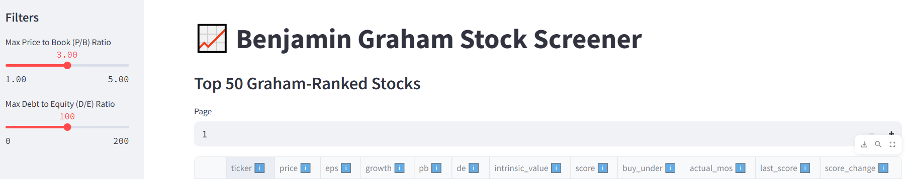

# My-Stock-Screener

## Description
Stock screener to rank SP500 US stocks according to [adjusted Benjamin Graham formala](https://www.oldschoolvalue.com/stock-valuation/benjamin-graham-formula/)

## Deployment at local machine
1. Install python package in requirements.txt
```
pip install -r requirements.txt
```
2. Add Path environment variables for python scripts, example below:
```
%userprofile%\AppData\Local\Programs\Python\Python313\Scripts\
```
3. Register free account at https://fred.stlouisfed.org/ and create a free api key
4. Run commands
```
set FRED_API_KEY=<Fred Api Key>
streamlit run dashboard.py
```

## Deployment steps at Streamlit
1. Fork this project
2. Register free account at https://fred.stlouisfed.org/ and create a free api key
3. Register free account at https://streamlit.io/
4. Create app at streamlit
5. Add key secret to app
```
FRED_API_KEY = "<Key at Step 2>"
```

## Known issues
Currently, the app may be slow in scraping growth data from the web. When deployed in streamlit cloud, it might encounter traffic throttling issues. Better to run it in your local machine for full results.

## Disclaimer
Use the tool at your own discretion, invest within your own means